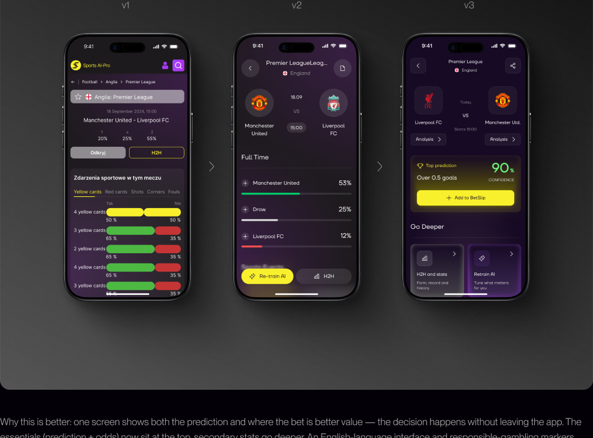
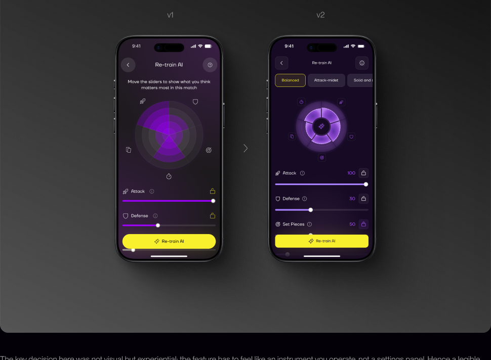
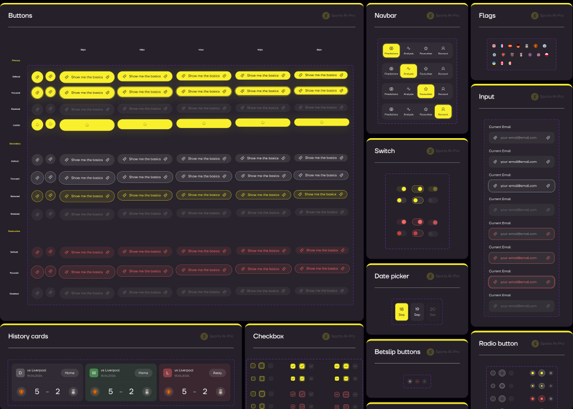

## 01 — Starting point

### The technology worked. The interface didn't communicate it.

Opening the app, users met inconsistent typography, unpredictable navigation and data-heavy screens with no clear hierarchy. For a product that asks people to bet on AI confidence scores, visual trust isn't a nice-to-have. It is the product.

Beyond redesigning what existed, three key features had to be designed from scratch: AI model re-training — the product's core feature — bookmaker odds comparison, and the betslip.

The app worked technically, but a dated, fragmented interface undermined trust — and trust is what a product that tells you where to bet stands on. The founder's goal: bring design and experience up to the level of the technology underneath.

<figure>
  
  <figcaption>The starting point — the original app, annotated where the interface broke trust.</figcaption>
</figure>

## 02 — Ownership

### Sole designer — from audit to handoff.

I owned the entire design process — audit, UX flows, UI, three new features, the component library and developer handoff — working directly with the founder.

This was a solo project with no existing design system, no ready components and no prior UX documentation. Everything in this case reflects my own work and decisions.

## 03 — Research

### Three patterns were breaking user trust.

I went through every screen and documented the specific places where the interface broke trust. Every insight came from what was actually in the product — not from guesswork.

  

    01
    The key number didn't stand out
    
Confidence scores — the reason people open the app — carried the same weight as team names: same size, same colour, edge of the screen. There was nothing for the eye to catch, and a strong prediction looked exactly like a weak one.

    
Separately, the light grey surfaces failed — highlighted match rows and league pills. White text on them fell below acceptable contrast.

  

  

    02
    Data spilled out with no hierarchy or grouping
    
On the team screen — six identical rows in a row: Avg goals, Avg goals conceded, Avg shots on target, Avg corners, Avg fouls, Avg yellow cards. Identical bars, equal weight, no grouping.

    
On the stats screen the form ring, the tournament dropdown, the recent-matches strip and the league table sat one after another with no sections. Instead of leading the eye from primary to secondary, the screen showed everything at once.

  

  

    03
    The interface felt like several different products
    
Button styles differed between screens, navigation icons varied, and the bottom menu was labelled sometimes in Polish, sometimes in English.

    
Without a single system the app lost coherence — and with it the sense of reliability.

  

  INSIGHT
  
None of these problems was technical. All three were about how the interface communicates trust.

## 04 — Approach

### Trust is a consequence of structure, not decoration.

Three principles drove every design decision.

  

    01
    

      
Hierarchy first, surface second

      
Before touching colour or form, I decided on every screen what was primary, what was secondary and what could go. The confidence score became the anchor of the card — everything else was built around it. The visual language only arrived once the structure already worked in black and white.

    

  

  

    02
    

      
One meaning per signal

      
Every colour, surface and icon had to mean exactly one thing. Grey stopped meaning "selected", "collapsed" and "tappable" at the same time. It sounds like hygiene, but in a product that tells people where to put money, a predictable interface is what trust in the prediction grows out of.

    

  

  

    03
    

      
New features are comprehension problems, not screens

      
Odds comparison, the betslip and model re-training all arrived as "draw me a screen" requests. Each one was really the question "how do I show a person what the model is doing, so they can act on it?" So design started from the user's decision, not from a layout.

    

  

## 05 — Core work

### Redesigning the prediction screens, plus three new features built from scratch.

#### Match screen + odds comparison — "Users had no way to compare odds."

On the old match screen the main prediction (1 / X / 2) was lost under a long table of secondary stats — cards, shots, corners. The core issue: the user saw a prediction but had no way to tell where the bet was better value.

I rebuilt the screen around the decision. The prediction became a Full Time (1X2) block — team names, percentages and visual bars, sorted by probability. The key new feature is the Compare odds table: odds from several bookmakers (Fuksiarz, BetFan, LV Bet) in a single 1 / X / 2 format, with the best value in each column highlighted and a "Compare 5 bookmakers" action.

Why this is better: one screen shows both the prediction and where the bet is better value — the decision happens without leaving the app. The essentials (prediction + odds) now sit at the top, secondary stats go deeper. An English-language interface and responsible-gambling markers (18+, Play responsibly) are a step toward a wider market.

#### AI re-training — "The re-training logic already existed. An interface a user could actually operate did not."

Model re-training is the core feature of Sports AI-Pro: it is what separates the product from an ordinary prediction aggregator. The founder wanted to give users control over the AI model — to tune its weights to their own read of a match. The re-training logic already existed; there was no interface for it. My job was the screen through which it could be operated.

I reduced the controls to three elements: a radar chart showing the current weight of each factor, sliders to change them, and lock states to pin whatever the user does not want touched. The factor set adapts per sport — in football it is attack, defence, set pieces, fouls and tempo; in basketball, efficiency and control; in tennis, serve and aces. One action closes the screen: Re-train AI.

The key decision here was not visual but experiential: the feature has to feel like an instrument you operate, not a settings panel. Hence a legible radar chart instead of a list of numbers, instant slider feedback, and a single unambiguous action button.

#### The betslip

A supporting feature — the place where selected predictions accumulate and the combined probability is visible.

## 06 — Scalability

### One component library on shared styles.

I built a full component library in Figma — typography, colour styles, prediction and betslip cards, chips, segmented controls, tab bars, bottom navigation, bottom sheets, progress bars, probability indicators, button states, forms, locked/unlocked states. Every component with variants and states: a fix at library level propagates to every screen.

Components were designed not for football but for every sport in the app — and those have different stat models: football has H2H and goals, tennis has sets, basketball has quarters. So prediction cards, probability indicators and stat blocks are built as configurable structures, not fixed layouts for one scenario. Football appears in this case as the reference; everything else assembles from the same components with no separate design per sport.

At this stage it was a library, not a design system: shared components and colour styles, but no tokens or variables. The full system came later, in v3 — see section 10.

## 07 — Beyond the app

### A paywall that feels like part of the product.

Launch assets carried the same visual language as the app. App Store screens led with the value:

- Get AI-powered insights for every sport — 16 sports, 5850 leagues worldwide, thousands of predictions daily, advanced AI analytics & stats.
- Build your custom AI model.
- Create your personal Prediction Slip.
- Analyse leagues & teams.
- Explore detailed stats.
- Head-to-head stats for smarter picks.

  
  
  
  
  
  

<figure>
  
  <figcaption>Landing page — the same visual language, carried to the web.</figcaption>
</figure>

<figure>
  
  <figcaption>Paywall variants — every screen leads with what's unlocked before the price.</figcaption>
</figure>

## 08 — Impact

### The release gave a strong start. Analytics showed where the real bottleneck was.

| Metric | Dec '25 | Jan '26 · peak | May '26 |
| --- | ---: | ---: | ---: |
| Revenue / mo | $159 | **$558** | $225 |
| MRR | $159 | **$503** | $148 |
| Active subscriptions | 14 | **30** | 19 |
| New paid subscriptions | 12 | **29** | 11 |
| Purchase conversion | 2.4% | **3.3%** | 3.2% |

The redesign lifted purchase conversion and drove a strong January peak. But revenue peaked and then fell back by spring — acquisition and first-purchase worked; keeping subscribers did not.

## 09 — Retention

### The next design problem is retention.

The funnel made the priority obvious: the bottleneck was not the first screen but what happens after it. The value shows up before the subscription; the reason to come back does not. That reframed v3 — from polishing screens to designing for the return visit: onboarding that hands the user control of the model, and a paywall that proves its worth before payment.

## 10 — V3: what is already built

### From findings to the next version.

#### The design system v2 never had

Before v3 we had a component library and colour styles — but not a system. There were no tokens or variables: the client did not want to invest in them, and I assembled screens quickly to get results to him faster. Development shipped v2 without a system too. That worked right up until the product started to grow.

Before v3 I proposed doing it properly, and this time the argument landed. Tokens and variables appeared, components expanded and came together as a full system in a separate file, and the app began to be rebuilt on it.

The effect is structural: a change is made in one place and propagates across every screen. What used to mean manually walking through dozens of mockups now takes minutes, and new features assemble from ready components instead of being drawn from scratch. Iterations got faster, and inconsistencies between screens disappeared as a category.

#### Workflow: AI → Figma → system

This is not "AI draws the design". It is a pipeline where generation takes the routine, while framing the problem, the decisions and the quality stay with me.

In v2 no such pipeline existed: there was no MCP link to Figma yet, and mockups were made by hand. The ability to close the loop only arrived during v3 — and the process changed completely.

The steps: receive a brief from the client → in Claude Code rewrite it into a structured, unambiguous brief for generation (the most important step — mockup quality is set by the framing, not by a random prompt) → pass it to Claude Design for a first version → several iterations through Claude Code → Claude Design until the mockup is right → show the client → once approved, move it into Figma → finish by hand (grid, spacing, states) → second review → extract components into the design system → review, fix, publish the library → assemble the next screens from published components.

The gain is not that there is less drawing. The gain is that the cycle "brief → approved mockup → component in the system" closes in a single pass, and the system grows together with the product.

<figure>
  
  <figcaption>Workflow: AI → Figma → system — generation takes the routine; framing, decisions and quality stay with me.</figcaption>
</figure>

#### iOS only — a decision from the data

The conversion segmentation in section 08 — ≈4.2% on iOS versus ≈1% on Android — had a direct consequence: we dropped the Android version. That meant deliberately letting go of 85% of the audience — the part that barely pays — and concentrating the entire v3 effort on iOS, where conversion is four times higher. The decision rested on a segment's ability to pay, not on its size.

#### Onboarding leads with Retrain AI

Model re-training is the core feature of Sports AI-Pro, and in the new onboarding it comes first: from the very first minutes the user tunes the AI to a specific match, sport and their own bet type, rather than building a betslip.

The hypothesis: a finished answer from an AI leaves the user passive, while control over it draws them in. Someone who has tuned the model to their own view has a reason to come back and check the result. This is where we expect the effect on retention.

The screen structure and scroll behaviour were also rebuilt — the feature broke on long lists.

#### Trial: the result is visible before payment

Two paywall variants — an annual plan with a 7-day trial and weekly access with a 3-day one. Both first show exactly what is being unlocked: 16 sports, custom AI models, personalised betslips, detailed team stats.

The hypothesis from section 09: if the value is visible before payment, fewer people drop off in the first week.

#### Depth worth coming back for

Reworked prediction cards and match details, a new H2H, an Analysis Panel with new charts. The betslip remains as a supporting feature — the place where selected predictions accumulate and the combined probability is visible.

  
  
  

Bookmaker odds are being added: the user sees odds from different bookmakers for an event and moves through to the app's partners. This used to send them outside — now it is both a reason to stay in the product and a monetisation channel. For the Polish market first.

**Accessibility.** Interface contrast was checked, including for different types of colour vision deficiency.

  
  
  
  

## What I learned

### Measure design where it actually has influence — and honestly give the rest to traffic and seasonality.

The most important lessons came not from the release but from the data after it. Design did its part — trust in the predictions and purchase conversion (7-day rose from ~2.1% to ~3.0%) — but the real bottleneck turned out not to be where I expected: not the first screen, but retention. That taught me two things: to separate design's contribution from traffic and seasonality honestly, and to start from a metric design can actually move, rather than from the most visible screen.

A professional conclusion about the product: in AI-based apps, interface logic and visual design are inseparable. A user does not trust a feature they cannot model in their head — so confidence states, probability labels and explanations of the source mattered more than aesthetics.

The product is in active development, and this case will grow with it. The next stage is work on retention (onboarding, trial, activation); I will add the results of those iterations here once they are live.
